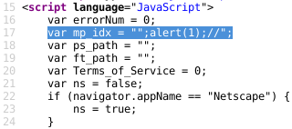

A reflected Cross Scripting vulnerability, CVE-2019-9955, was identified on several Zyxel devices, specifically on pages that use the **mp_idx** parameter. The affected pages (listed later in this report) do not require authentication.  

## Patch

* **ATP500**: <ftp://ftp.zyxel.com/ATP500/firmware/433ABFU0ITS-WK12-r87753.zip>
* **USG40**: <ftp://ftp.zyxel.com/USG40/firmware/433AALA0ITS-WK12-r87753.zip>
* **USG1900**: <ftp://ftp.zyxel.com/USG1900/firmware/433AAPL0ITS-WK12-r87753.zip>
* **ZyWALL1100**: <ftp://ftp.zyxel.com/ZyWALL_1100/firmware/433AAAC0ITS-WK12-r87753.zip>
* **ZyWALL310**: <ftp://ftp.zyxel.com/ZyWALL_310/firmware/433AAAB0ITS-WK12-r87753.zip>

## Timeline

* 06 Feb 2019 - Issue discovered on USG40 and disclosed to Zyxel
* 24 Feb 2019 - Issue confirmed by Zyxel, initial hotfix released
* 01 Apr 2019 - Additional vulnerable devices identified and reported to Zyxel
* 10 Apr 2019 - Additional patches available
* 15 Apr 2019 - Public Disclosure

## Description

The issue was identified during a network layer penetration test performed by SecurityMetrics, Inc.. During this assessment, several Zyxel devices appeared on the customer's port scan. Log in pages (similar to the screenshot shown below) were accessible.

Zyxel documentation was used to determine valid parameters (including [web_portal_html_guide.pdf](ftp://ftp.zyxel.it/guide/hotspot/uag2100_4100_5100_web_portal_html_guide.pdf), as shown below ).

A request such as:

~~~
$HOST/weblogin.cgi?mobile=1&mp_idx=";alert(1);//
~~~

Specifies an **mp_idx** parameter which is included unsanitized in the page:

`";` closes the string used for **mp_idx**.  Additional JavaScript, such as `alert(1);`, could then be added.  The malicious string ends with `//`, commenting out any lingering characters.

The `alert` is interpreted and triggered when the page is visited:

## Affected Pages and Devices

~~~{command="Tested Pages"}
weblogin.cgi            webauth_relogin.cgi
~~~

~~~{command="Tested Devices"}
ZyWALL 310          ZyWALL 110          USG1900         USG40           ATP500
~~~

Additional devices and pages may also be vulnerable, however, this issue was identified during a black-box test; credentials were not provided, pages requiring authentication were not tested, additional devices were not available for testing.
