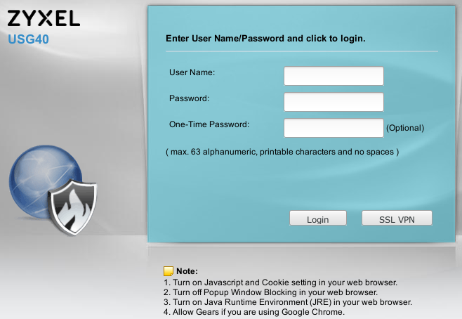
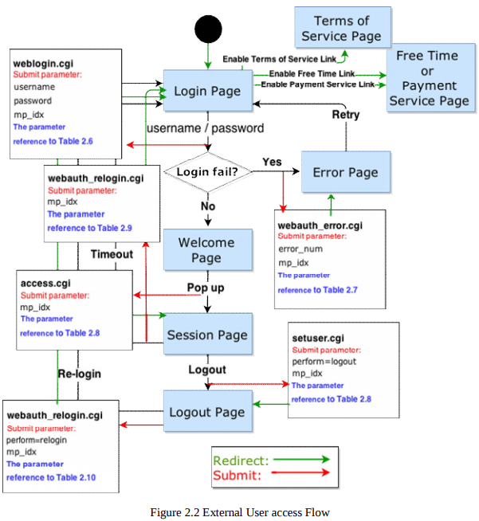
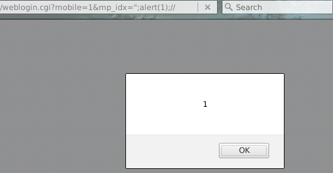

# Issue

A reflected Cross Site Scripting issue was identified on several Zyxel devices, on pages that use the **mp_idx** parameter.  The affected pages, included in this report, do not require authentication.  

# Description

The issue was identified during a Network Penetration Test for a SecurityMetrics, Inc. customer using several Zyxel devices.  While investigating devices that appeared on the Port Scan, the analyst noted there were several login pages, similar to the following:

<pagebreak></pagebreak>

The analyst referenced Zyxel documentation, such as the `web_portal_html_guide.pdf`:

To identify what parameters are used and what pages use the parameter.  Several pages use the **mp_idx** parameter and include it in the page without validation.  A request such as `$HOST/weblogin.cgi?mobile=1&mp_idx=";alert(1);//` injects the **mp_idx** parameter in the source of the page:

<pagebreak></pagebreak>

The `alert` is interpreted and triggered when the page is visited:

# Affected Pages and Devices

The analyst has verified the following pages are vulnerable:

* weblogin.cgi
* webauth_relogin.cgi

Additional devices and pages may also be vulnerable, however, this was a black box test.  Credentials were not provided, pages requiring authentication were not tested, and additional devices were not available for testing.  The following devices are known to be vulnerable:

* ZyWALL 310
* ZyWALL 110
* ATP 500
* USG1900
* USG40
